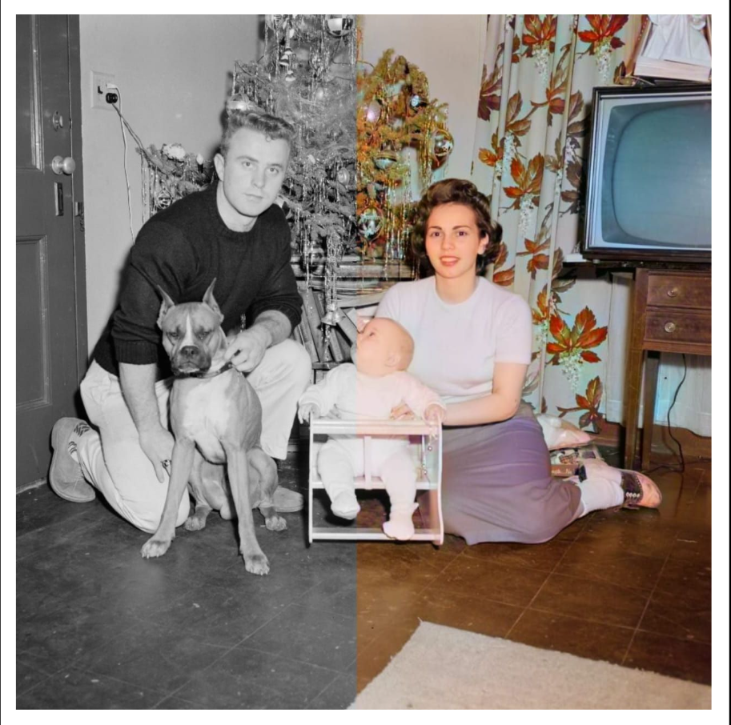

# Colorize Your Grayscale Images Using DeOldify and Gradio

## Technologies Used

Python | OpenCV | Gradio | DeOldify

## Project Description

In today’s digital age, we sometimes come across memories that are old black-and-white images that lack the vibrancy and realism of color. Imagine adding colors to those black-and-white memories to make them come to life.

In this project, will learn how to colorize grayscale images using DeOldify, a deep learning-based tool that colorizes and restores old black-and-white photos with remarkable accuracy.
Moreover, we will enhance the experience by creating a user-friendly graphical user interface (GUI) using Gradio, making the project easy and enjoyable to use

