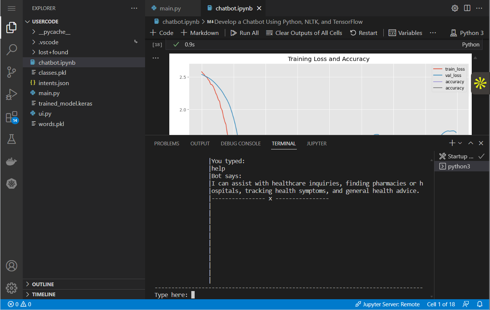

# Develop a Chatbot Using Python, NLTK, and TensorFlow

 In this project, develop a custom chatbot using Python APIs of the Natural Language Toolkit (NLTK) library and TensorFlow. The chatbot will be a simple one whose functions can be built on and further enhanced

## Technologies Used

NLTK | Python | Pillow | TensorFlow | Python APIs | Natural Language Toolkit (NLTK) library | Deep Neural Network

## Key Learnings

* Read and save data, using Python
* Perform tasks like tokenization and lemmatization, using NLTK
* Save, reload, and utilize the trained model
* Build, compile, and train the deep neural network

## Project Description

Develop a chatbot using deep learning techniques. The chatbot will be trained with a dataset including categories (intents), patterns, and responses. We’ll use a specialized recurrent neural network (LSTM) to detect the category of the user’s message, and the chatbot will choose a random response from a list of potential replies.

## Screenshots

